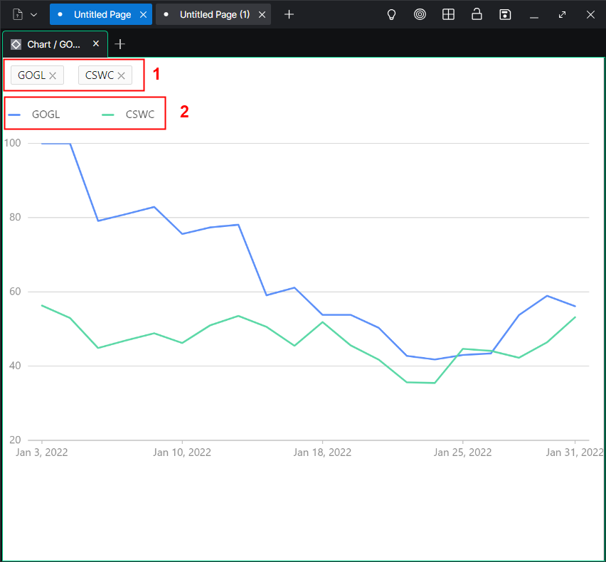

## Chart App

---

Visualizes data in Line Chart View based on selected Tickers.

---

1. Selected tickers (minimum 1). Can be changed from the [News App](./NEWS_APP.md) according to the [Linking workflow](./LINKING.md).

2. Lines that are displayed depend on the selected Tickers. By clicking on each line in this section you can hide/show lines.
