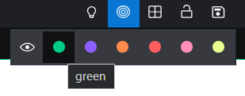

## Linking Apps (Context sharing communication) workflow.

1. Open 2 new windows. Top-Left menu -> "Open New Window"

2. Select Chart in the first and News in the second from the [App Launcher](./DEFAULT_APP.md)

3. Link apps by one color. In each window select green color from the menu. 

4. In [News App](./NEWS_APP.md) change Tickers list.

**Expected:** [Chart App](./CHART_APP.md) is displaying valid data according to the changes in the News.
