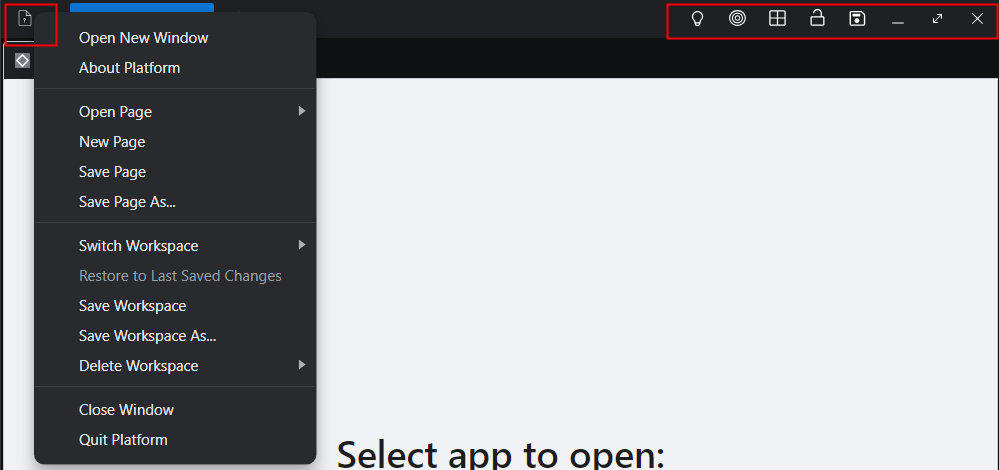
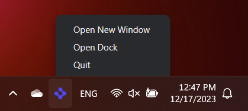

## Toolbar buttons & menus



All actions work as expected.

Users can save Workspace or Page with predefined context and reopen them if needed.

---

## Tray menu



Menu items works as expected.

```Bash
# Please note that this menu is the default one for the Tray, and it lacks the functionality to always stay on top. Therefore, to access it, you should minimize all windows on the screen and then open it. It's worth mentioning that the menu is beyond the scope of this course, so the current functionality should be sufficient for its intended use.
```

---
