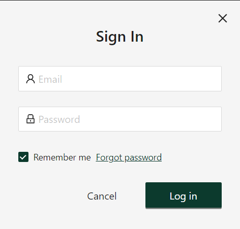

## Sign In

Note install and launch projects to see sign-in window.

---

Credentials to sign in. User is hardcoded in the Server

| Email          | Password  |
| -------------- | --------- |
| test@email.com | Pa$$W0rd! |

---

Window contains all required validations and `Remember me` is working too.
